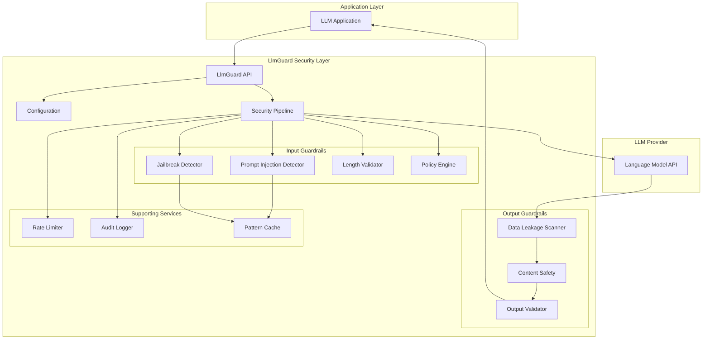
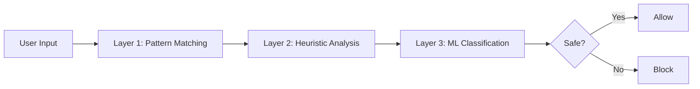
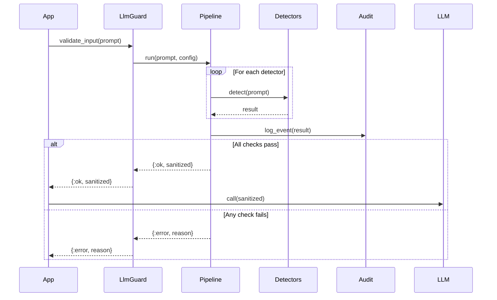
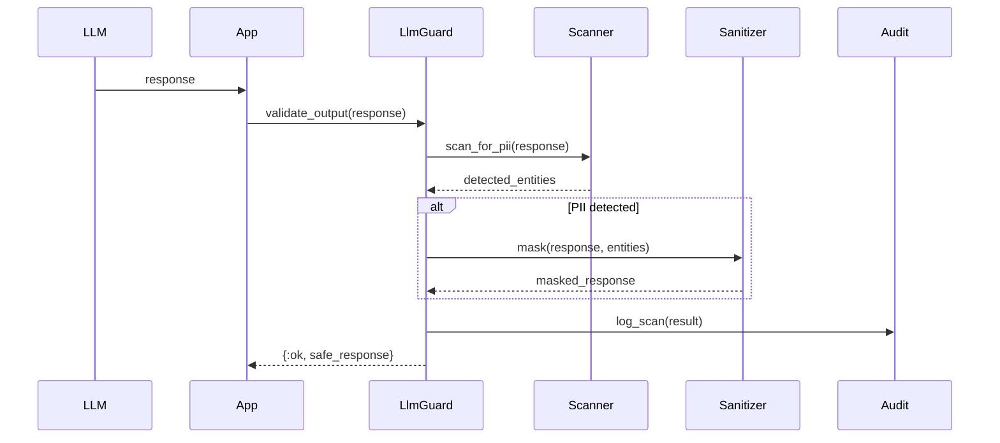
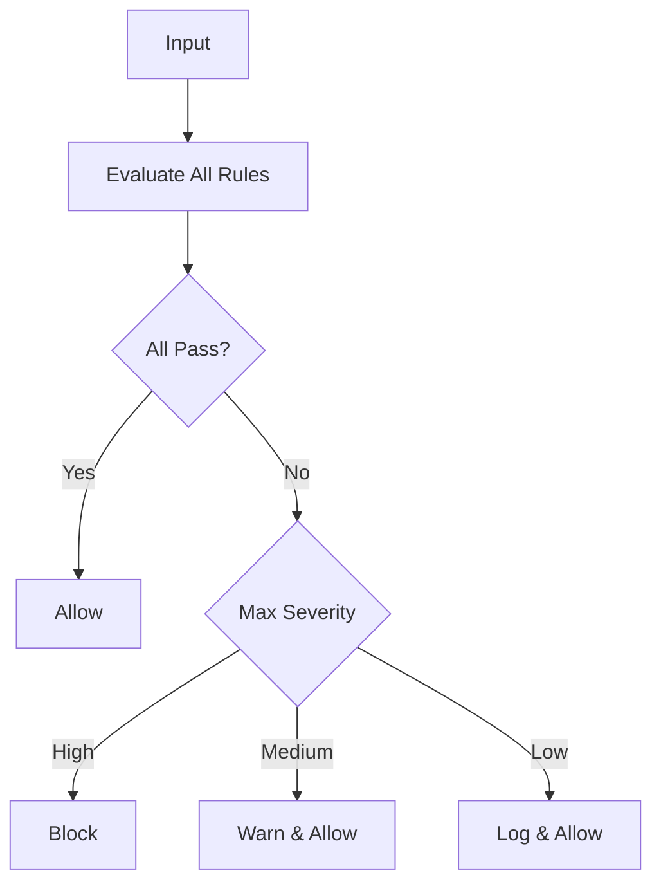
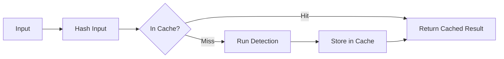
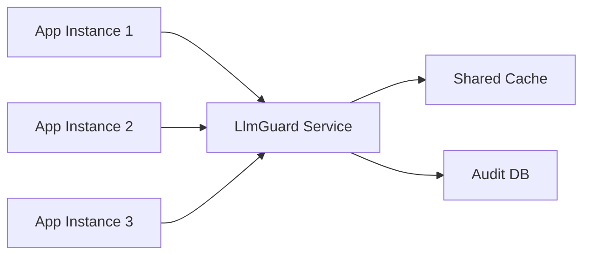

# LlmGuard Architecture

## Overview

LlmGuard is designed as a modular, extensible security framework for LLM-based applications. The architecture follows defense-in-depth principles with multiple security layers working independently and cooperatively.

## System Architecture



## Core Components

### 1. LlmGuard API

**Module**: `LlmGuard`

The main entry point providing high-level functions:

- `validate_input/2` - Validates and sanitizes user input
- `validate_output/2` - Validates LLM responses
- `validate_batch/2` - Batch processing for multiple inputs
- `async_validate_batch/2` - Asynchronous batch processing

### 2. Configuration System

**Module**: `LlmGuard.Config`

Centralized configuration management:

```elixir
%LlmGuard.Config{
  # Detection toggles
  prompt_injection_detection: true,
  jailbreak_detection: true,
  data_leakage_prevention: true,
  content_moderation: true,

  # Thresholds
  confidence_threshold: 0.7,
  max_input_length: 10_000,

  # Custom detectors
  custom_detectors: [],

  # Rate limiting
  rate_limit_config: %{},

  # Audit logging
  audit_enabled: true
}
```

### 3. Security Pipeline

**Module**: `LlmGuard.Pipeline`

Orchestrates execution of security checks in a defined order:

```elixir
pipeline = LlmGuard.Pipeline.new()
  |> Pipeline.add_stage(:length_check, LengthValidator)
  |> Pipeline.add_stage(:prompt_injection, PromptInjection)
  |> Pipeline.add_stage(:jailbreak, Jailbreak)
  |> Pipeline.add_stage(:policy, PolicyEngine)
```

**Features**:
- Sequential execution with early termination on failure
- Async execution for independent checks
- Error handling and recovery
- Performance monitoring

### 4. Detector Framework

**Module**: `LlmGuard.Detector` (Behaviour)

All detectors implement the `Detector` behaviour:

```elixir
defmodule LlmGuard.Detector do
  @callback detect(input :: String.t(), opts :: keyword()) ::
    {:safe, map()} | {:detected, map()}
end
```

**Built-in Detectors**:
- `LlmGuard.PromptInjection` - Detects prompt injection attempts
- `LlmGuard.Jailbreak` - Detects jailbreak attempts
- `LlmGuard.DataLeakage` - Scans for PII and sensitive data
- `LlmGuard.ContentSafety` - Moderates harmful content

## Detection Strategy

### Multi-Layer Detection



### Pattern Matching (Layer 1)

Fast, rule-based detection using regex and string matching:

- Known malicious patterns
- Signature-based detection
- Low latency (~1ms)

### Heuristic Analysis (Layer 2)

Statistical and linguistic analysis:

- Entropy analysis
- Token frequency analysis
- Structural anomaly detection
- Medium latency (~10ms)

### ML Classification (Layer 3)

Machine learning-based detection:

- Transformer-based embeddings
- Fine-tuned classifiers
- Ensemble methods
- Higher latency (~50-100ms)

## Data Flow

### Input Validation Flow



### Output Validation Flow



## Policy Engine

### Policy Structure

```elixir
%LlmGuard.Policy{
  name: "production_policy",
  rules: [
    %Rule{
      id: :no_system_prompts,
      type: :input,
      validator: fn input -> ... end,
      severity: :high
    },
    %Rule{
      id: :max_length,
      type: :input,
      validator: fn input -> ... end,
      severity: :medium
    }
  ],
  actions: %{
    high: :block,
    medium: :warn,
    low: :log
  }
}
```

### Policy Evaluation



## Rate Limiting

### Token Bucket Algorithm

```elixir
%RateLimiter{
  user_id: "user123",
  buckets: %{
    requests: %{capacity: 60, tokens: 60, refill_rate: 1/s},
    tokens: %{capacity: 100_000, tokens: 100_000, refill_rate: 1667/s}
  },
  last_refill: ~U[2024-01-01 12:00:00Z]
}
```

**Features**:
- Per-user rate limiting
- Multiple bucket types (requests, tokens)
- Distributed rate limiting support (via Redis/ETS)
- Graceful degradation

## Audit Logging

### Event Structure

```elixir
%AuditEvent{
  id: UUID,
  timestamp: DateTime,
  event_type: :prompt_injection_detected,
  user_id: "user123",
  session_id: "session456",
  severity: :high,
  action: :blocked,
  metadata: %{
    input: "...",
    detector: LlmGuard.PromptInjection,
    confidence: 0.95,
    patterns_matched: ["ignore previous instructions"]
  }
}
```

### Storage Backends

- **ETS** - In-memory, fast (default)
- **Database** - PostgreSQL, MySQL (via Ecto)
- **External** - Elasticsearch, Splunk (via adapters)

## Performance Optimization

### Caching Strategy



**Cache Levels**:
1. **Pattern Cache** - Compiled regex patterns
2. **Result Cache** - Detection results (with TTL)
3. **Embedding Cache** - ML embeddings

### Async Processing

```elixir
# Parallel detection
tasks = detectors
  |> Enum.map(fn detector ->
    Task.async(fn -> detector.detect(input) end)
  end)
  |> Task.await_many()
```

### Streaming Support

For large inputs, support streaming validation:

```elixir
LlmGuard.stream_validate(input_stream, config)
|> Stream.map(&process_chunk/1)
|> Enum.to_list()
```

## Extensibility

### Custom Detectors

```elixir
defmodule MyApp.CustomDetector do
  @behaviour LlmGuard.Detector

  @impl true
  def detect(input, opts) do
    # Custom detection logic
  end
end

config = LlmGuard.Config.new()
  |> LlmGuard.Config.add_detector(MyApp.CustomDetector)
```

### Plugin System

Future enhancement for third-party plugins:

```elixir
LlmGuard.Plugin.register(MyPlugin, %{
  detector: MyPlugin.Detector,
  config: %{},
  priority: 10
})
```

## Deployment Considerations

### Standalone Mode

LlmGuard runs within the application process:

```elixir
# In application supervision tree
children = [
  {LlmGuard.Supervisor, config}
]
```

### Distributed Mode

LlmGuard can run as a separate service:



### Scaling Strategy

- **Horizontal**: Multiple LlmGuard instances with shared cache
- **Vertical**: Increase detector parallelism
- **Edge**: Deploy detectors closer to users for lower latency

## Security Guarantees

1. **Defense in Depth**: Multiple independent detection layers
2. **Fail Secure**: Block on uncertainty
3. **Zero Trust**: Validate all inputs and outputs
4. **Audit Trail**: Complete logging for forensics
5. **Performance**: <50ms p95 latency for most detections

## Future Enhancements

1. **Federated Learning**: Collaborative model training
2. **Real-time Updates**: Live threat intelligence integration
3. **Advanced Analytics**: ML-powered anomaly detection
4. **Multi-modal**: Support for image/audio inputs
5. **Privacy Preserving**: Homomorphic encryption for sensitive data
